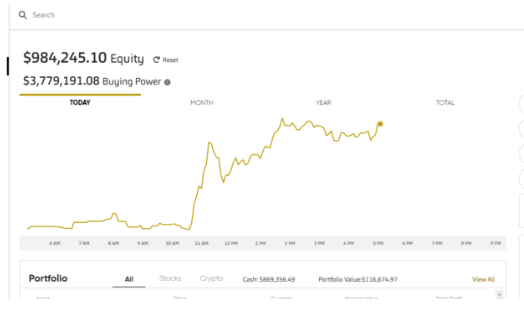

# Project 2 #

## Project Proposal ##

### Group 3 - Investment Wallys ###

Wallys SAAS Widgets is a made up company that gets its revenue from subscription sales.
These subscriptions are paid for in either USDC, ETH or WBTC crypto currencies. 

Our objective is to build a solution to manage their treasury. For short term payments, salaries and other outgoings, Wally's needs to keep a low risk, liquid threshold of 40% USDC in its treasury with the remaining 60% made up of crypto coins.  Our trading bot manages the buy and sell of crypto currencies to keep the funds of USDC at optimum levels for operating expenses.  

The Wally's accounts team have created their own version of an automated market maker. In our model, our trading bot will iterate over the last twelve months of data using our proprietry trading algorythms. The daily OHLCV data sets are sourced from the Coinbase Exchange platform via our Alpaca trading account. Focused only on the daily data, we first analyse the most profitable strategy for the last twelve months. 

Using indicators including Moving Average Convergence/Divergence (MACD), MYC Trading Indicator, Relative Strength Index (RSI), Bollinger Bands and Moving Averages (MA), we will determine based on our historical data,the best moments to “buy” and “sell” (trading signals) of our chosen trading strategy. 
We then test to find the best predictive model from one of  predictive models: Desion tree, Propet, AdaBoost, SVC and the Linear Regression models. 

After training different classification models using the training data, we compare accuracy, precision and recall of different models and determine the model with the optimum performance for the next month. 

After refining our strategy, we use the model to forecast the investment position as at the end of the month for our finance team. We also use the model to refined strategy. Similar to an exponential model, we have observed that the best results are produced from a data set consisting of a twelve month period.

At the end of the month, the balance of our successful trading period is accounted for in our Tresury account.

At the end of the month, the balance of our successful trading period is accounted for in our Tresury account. Subject to the volitatly in the selected crypto price, our month-end  balance should sit at 40% USD with a reliably predicted increase in our holdings of crypto currencies.  During the month the bot will continue to trade using the optimal combination of indicators for our trading strategy. We also use the prediction model to provide a mid month forcast for our financial reporting. This strategy of check, scale, test and predict should yeild a consistant and reliable result month on month with minimal risk acceptable to our ever trusting partners. 

Credits

# Git Manager# 
Robert

# Data pre-processing, Alpaca Data - 3 years #
Karin
Vicky

# Trading bot code and Alpaca #
Leigh
Robert
Ilia

# Prophet Model #
Ilia
Vicky

# Linear Regression Model #
Karin
Vicky

# Visual Representations - new Library Candlestick chart #
Karin
Vicky

# Presentation preparation #
Karin
Vicky
