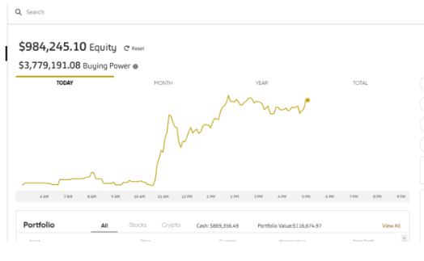

## Project Proposal ##

### Group 3 - Investment Wallys ###

Wallys SAAS Widgets is a company that gets its revenue from subscription sales.
These subscriptions are paid for in either USDC, ETH or WBTC crypto currencies. 

Our objective was to build a solution to manage their treasury. For short term payments, salaries and other outgoings, Wally's needed to keep a low risk, liquid threshold of 40% USDC in its treasury with the remaining 60% made up of crypto coins.  Our trading bot manages the buy and sell of crypto currencies to keep the funds of USDC at optimum levels for operating expenses.  

The Wally's accounts team have created their own version of an automated market maker. In our model, our trading bot will iterate over the last twelve months of data using our proprietry trading algorythms. The daily OHLCV data sets are sourced from the Coinbase Exchange platform via our Alpaca trading account. Focused only on the daily data, we first analyse the most profitable strategy for the last twelve months. 

Using indicators including Moving Average Convergence/Divergence (MACD), Relative Strength Index (RSI), Bollinger Bands and Moving Averages (MA), we determine based on our historical data, the best moments to “buy” and “sell” (trading signals) of our chosen trading strategy. We then test to find the best predictive model from one of the predictive models: Desion tree, Prophet, AdaBoost, SVC and the Linear Regression models. 

After training different classification models using the training data, we compare accuracy, precision and recall of different models and determine the model with the optimum performance for the next month. The results of the trading algorithm with best outcome we will later separate on features X (information about the price fluctuation and indicators) and predictions y (trading signals). Further the data will be split  on the training and testing sets. We will scale data. 

After refining our strategy, we use the model to forecast the investment position as at the end of the month for our finance team. We also use the model to refined strategy. Similar to an exponential model, we have observed that the best results are produced from a data set consisting of a twelve month period.

At the end of the month, the balance of our successful trading period is accounted for in our Tresury account. Subject to the volitatly in the selected crypto price, our month-end  balance should sit at 40% USD with a reliably predicted increase in our holdings of crypto currencies.  During the month the bot will continue to trade using the optimal combination of indicators for our trading strategy. We also use the prediction model to provide a mid month forcast for our financial reporting. This strategy of check, scale, test and predict should yeild a consistant and reliable result month on month with minimal risk acceptable to our ever trusting partners. 

## Brief description of our chosen classifiers.
### SVM - Support Vector Machine 
We used the SVM classifiers which is a regression techinique that maximises the predictive accurancy without overfitting the training data. 

### Logistic Regression
Is usefull where there are a volume of features of little value and can be ignored. It is a supervised learning technnique that is good at predicitng the probability of events based on dependant variables. Not all data fits a model cleanly which is why regression is good to analyzis the relationship between the variables.

### AdaBoost
"Ada" or Adaptive Boosting was used to assess the accuracy and output data also. This works by adjusting or reassigning the weights to instances which reduces the bias in data sets. Accuracy after weight-reassigning and re-ittereating increases.

### Decision Tree
The Decision Tree clssifier identifies the best predictor (Root Node) after breaking the data down to develop smaller and smaller subsets. Entropy and Information Gain are used to construct the decision tree. Entropy is used to calculate the homogeneity of the different attributes. Information Gain identifies the most homogeneous branches which returns the highest information gain. 

# Strategy 1
## Simple Moving Average Trading Strategy (SMA)

We have used a simple moving average trading strategy to chart the price movement of the crypto currencies and ignore the day to day price fluctuations.  This way we can compare short, medium, and long term trends over large periods.

The movement from October 1 2021 to October 1 2022 is represented below for ETH and BTC. Here we have used Simple Moving Averages of 50 and 100 respectively and identified the crossed over points.

](https://github.com/RJSMART-11/Project-2-Group-3/blob/main/karin1.png)

From this we can see the SMA_200 is the best strategy to use for trading ETH and BTC in this portfolio.

](https://github.com/RJSMART-11/Project-2-Group-3/blob/main/karin2.png)

We used the Standard Scaler to train and test the data.  From there we used the SVM Model to create the predictions.  

One of the challenges we saw was the low accuracy represented in this model. However the strategy proved to be successful for both currencies.

](https://github.com/RJSMART-11/Project-2-Group-3/blob/main/karin3.png)

](https://github.com/RJSMART-11/Project-2-Group-3/blob/main/karin4.png)

](https://github.com/RJSMART-11/Project-2-Group-3/blob/main/karin5.png)

# Straegy 2
## Predicting ETHUSD and BTCUSD pairs with ML

### Data
Data for training ML models is provided by [Alpaca](https://alpaca.markets/).
This model has taken 3 year time interval from 2019 to 2022 for ETHUSD and BTCUSD to train models.
### Prophet 
As we only have control of the funds for a one month period invesetment, a forward prediction was necessary only for the next month.
](https://github.com/RJSMART-11/Project-2-Group-3/blob/main/Resources/Images/I1.png)
]https://github.com/RJSMART-11/Project-2-Group-3/blob/main/Resources/Images/I2.png)

After running the model, we predicte value for Bitcoin for the end of the December 2022 to be $9000 USD.

### Running the Model

For predicting next coin value we have used the reliable classifier; Linear Regression. The most challenging component was to prepare data for training. We have used feature extraction and feature selection techniques for this.

The thought process behind feature extraction was not limit ourselves 
with any values of rolling windows periods. We used EMA and SMA rolling windows with widths between 2 and 50 resulting into 100 new features. This strategy brought 8 percent profit over a one month period.

](https://github.com/RJSMART-11/Project-2-Group-3/blob/main/Resources/Images/Ilia1.png)

Then we have chosen most valuable features among them based 
on values of Linear Regression coefficients.
By selecting the top 10 features; SMA_20, SMA_28, SMA_27, SMA_6, SMA_22, EMA_3, SMA_21,SMA_5, SMA_4, and EMA_2, helped to increase the profit from 8 to 18 percent.

](https://github.com/RJSMART-11/Project-2-Group-3/blob/main/Resources/Images/Ilia2.png)

# Strategy 3
## MACD  Indicator

Moving Average Convergence Divergence (MACD)
A trend-following momentum indicator that shows the relationship between two moving
averages of a security's price.

The MACD line is calculated by subtracting the 26-period EMA from the 12-period EMA. A nine-day EMA of the MACD line is called the signal line, which is then plotted on top of the MACD line, which can function as a trigger for buy or sell signals. Traders may buy the security when the MACD line crosses above the signal line and sell—or short—the security when the MACD line crosses below the signal line. 
MACD is best used with daily periods, where the traditional settings of 26/12/9 days is the norm.
(investopedia.com)

](https://github.com/RJSMART-11/Project-2-Group-3/blob/main/Resources/MACD_Vicky/pic_1.png)

Above Screenshot visualises MACD method for BTC for the period 01.10.2021 - 01.10.2021.

Using crossing of the MACD line and signal line as an indicator to buy or sell we determined the optimal according to this strategy moments to buy and sell BTC.

](https://github.com/RJSMART-11/Project-2-Group-3/blob/main/Resources/MACD_Vicky/pic_2.png)

We calculated that cumulative return while using MACD indicator for trading in mantioned period would be negative 2.3 % (while actual cumulative return dropped by 57 %)

Following, we used coordinates of MACD line and signal line as a feature set and trading signals as a prediction set to train and test following prediction models:
SVM (Support vector machines)
Logistic Regression
AdaBoost
DecisionTreeClassifier

But first we split the data on training and testing set and standardiezed it. 

Each model was trained and tested. Each training and testing was followed by classification report, showing the results of accuracy, precision and recall. 

SVM testing report
](https://github.com/RJSMART-11/Project-2-Group-3/blob/main/Resources/MACD_Vicky/SVM_testing_report.png)

Logistic Regression testing report
](https://github.com/RJSMART-11/Project-2-Group-3/blob/main/Resources/MACD_Vicky/LR_testing_report.png)

AdaBoost testing report
](https://github.com/RJSMART-11/Project-2-Group-3/blob/main/Resources/MACD_Vicky/AB_testing_report.png)

DecisionTreeClassifier testing report
](https://github.com/RJSMART-11/Project-2-Group-3/blob/main/Resources/MACD_Vicky/DT_testingreport.png)

We also compared actual returns and trading algorithm returns.
SVM Returns
](https://github.com/RJSMART-11/Project-2-Group-3/blob/main/Resources/MACD_Vicky/SVM_returns.png)

Logistic Regression Returns
](https://github.com/RJSMART-11/Project-2-Group-3/blob/main/Resources/MACD_Vicky/LR_returns.png)

AdaBoost Returns
](https://github.com/RJSMART-11/Project-2-Group-3/blob/main/Resources/MACD_Vicky/AB_returns.png)

DecisionTreeClassifier Returns
](https://github.com/RJSMART-11/Project-2-Group-3/blob/main/Resources/MACD_Vicky/DT_returns.png)

After comparing the results we can conclude that the prediction model was most accurate with this MACD indicator trading algorithm is Logistic Regression. It showed a better result in accuracy, precision and recall.

### MACD Challanges

The challenge that I met during the prosses was to make my strategy profitable. On the bearish extremly volatile market MACD strategy doesn't show  positive results for Bitcoin, although results were better for different periods. 
The solutions that I tried included reversing the buy and sell signals pending the outcome of market conditions using a longer period market trend (EMA 200). This was able to identify if the market was bullish or bearish and therefor only permitted short positions in a negative market or only permitted long postions in a positive market.

# Live Market Trading
## The Alpaca model
With the aprovals of the finance team we have then invested our allocated funds in the market using the Alpaca trading plateform and our chosen strategy.

## ALPACA TRADING BOT ##
This Trading performs trade decisions via our strategy through the use of Alpaca
- CORE Functions:
    - Buy Orders
    - Sell order
    - Run Strategy
    - Liquidate Positions
- Key Features:
  -  Buy/ Sell limitation: Current buying power and current position versus size/value of trade
  - Pause Function: Allows the Bot to re-run every minute and updates our positions 
  - Account status: This allows us to observe an account overview and check our current positions and profit/loss
  - SMA Strategy implemented  for Machine learning and backtested algorithm 

Possible issues: Please run this when there is enough data to read strategy from, I.e market open/closed conditions

# Conclusion
## Challenges, results
Challenges -
Some of the challenges we faced during the duration of the project were inaccuracy in some of our classification models,
The inability of being able to produce short positions due to the crypto trading constraints of Alpaca.

Next steps
The next steps is to improve the accuracy of our some of the models,  develop and implement more trading strategies into our trading bot and also to check up on our portfolio to see how well our strategy’s performed.

## Presentation ##
https://my.visme.co/view/vdverqzj-d3o26v6690p7lgxw#s1
## Tools/libaries
  - TALIB
  - Finta
  - SKLEARN
  - Alpaca API
  - HVPLOT
  - MATPLOTLIB
  - Numpy
  - yfinance
  - mplfinance
  - sklearn

## Credits

### Git Manager### 
Robert

### Data pre-processing, Alpaca Data - 3 years ###
Karin
Vicky

### Trading bot code and Alpaca ###
Leigh
Robert
Ilia

### Prophet Model ###
Ilia
Vicky

### Logistic Regression Model ###
Karin
Vicky

### Visual Representations - new Library Candlestick chart ###
Karin
Vicky

### Presentation preparation ###
Karin
Vicky
