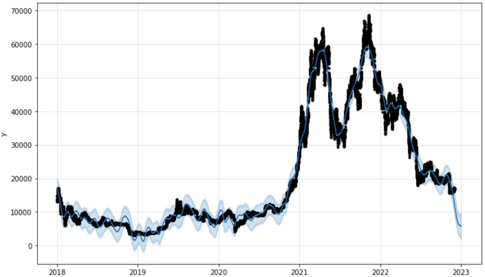
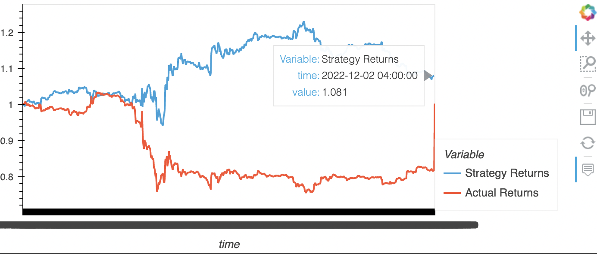
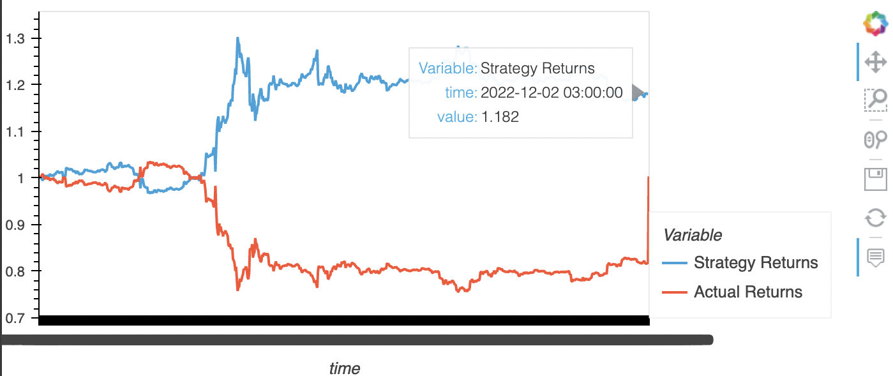

# Predicting ETHUSD and BTCUSD pairs with ML

## Data
Data for training ML models is provided by [Alpaca](https://alpaca.markets/).
We have taken 3 year time interval from 2019 to 2022 for ETHUSD and BTCUSD to train models/
## Prophet 
1 month prediction for BTCUSD

The preidicted value for Bitcoin for the end of 2022 is 9000 UDS.

## Strategy trading
For predicting next coin value we have been using Linear Regression,
which is pretty simple algorithm itself. The complecated part 
was to prepare data for training. We have used both 
feature extraction and feature selection techniques.
The Idea of feature extraction was not limit ourselves 
with any values of rolling windows widths.
Thus we used EMA and SMA rolling windows with widths between 
2 and 50 resulting into 100 new features.
This strategy brought 8 percent profit in a month.

Then we have chosen most valuable features among them based 
on values of Linear Regression coefficients.
Selecting top 10 features SMA_20, SMA_28, SMA_27, SMA_6, SMA_22, EMA_3, SMA_21,SMA_5, SMA_4, EMA_2
helped to increase the profit from 8 to 18 percent.

