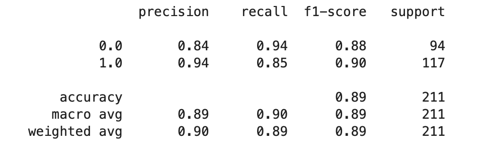

# Project - Investment Wallys #

## MACD  Indicator

Moving Average Convergence Divergence (MACD)
A trend-following momentum indicator that shows the relationship between two moving
averages of a security's price.

The MACD line is calculated by subtracting the 26-period EMA from the 12-period EMA. A nine-day EMA of the MACD line is called the signal line, which is then plotted on top of the MACD line, which can function as a trigger for buy or sell signals. Traders may buy the security when the MACD line crosses above the signal line and sell—or short—the security when the MACD line crosses below the signal line. 
MACD is best used with daily periods, where the traditional settings of 26/12/9 days is the norm.
(investopedia.com)

Above Screenshot visualises MACD method for BTC for the period 01.10.2021 - 01.10.2021.

Using crossing of the MACD line and signal line as an indicator to buy or sell we determined the optimal according to this strategy moments to buy and sell BTC.

We calculated that cumulative return while using MACD indicator for trading in mantioned period would be negative 2.3 % (while actual cumulative return dropped by 57 %)

Following, we used coordinates of MACD line and signal line as a feature set and trading signals as a prediction set to train and test following prediction models:
SVM (Support vector machines)
Logistic Regression
AdaBoost
DecisionTreeClassifier

But first we split the data on training and testing set and standardiezed it. 

Each model was trained and tested. Each training and testing was followed by classification report, showing the results of accuracy, precision and recall. 

SVM testing report

Logistic Regression testing report

AdaBoost testing report

DecisionTreeClassifier testing report

We also compared actual returns and trading algorithm returns.
SVM Returns

Lineal Regression Returns

AdaBoost Returns

DecisionTreeClassifier Returns

After comparing the results we can conclude that the prediction model that works the best with MACD indicator trading algorithm is Lineal Regression . As it has a better results of accuracy, precision and recall.

The challenge that I met during the prosses was to make my strategy profitable. On the bearish extrimly volatile market MACD strategy doesn't show  positive results for Bitcoin, although results were better for different periods. 
The solutions that I tryed: reverse buy and sell signals, reverse signals (short position) when EMA 200 shows negative change and others.
